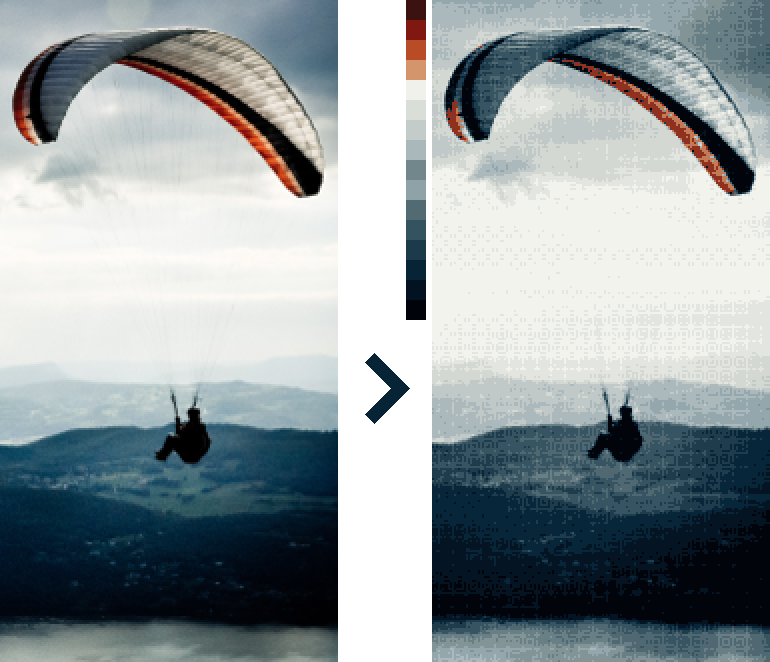

# Pixel Art Maker

Generate palettes and dither any image with personal patterns.



## Documentations

* [User Manual](doc/MANUAL.md)
* [Standard Sample](doc/EXAMPLE.md)

## Build

In order to build the project, you will need the following
dependencies, listed here as Debian packages:

* `cimg-dev`: This is CImg library, the C++ image processing library used by the project.
* `libboost-filesystem-dev`: The Boost Filesystem Library. Used to
  manipulate paths and files.

```
$ sudo apt-get install libboost-filesystem-dev cimg-dev
```

Then you can compile the project using the provided `Makefile`:

```
$ make
```

----  
https://github.com/Soreine/pixel-art-maker
