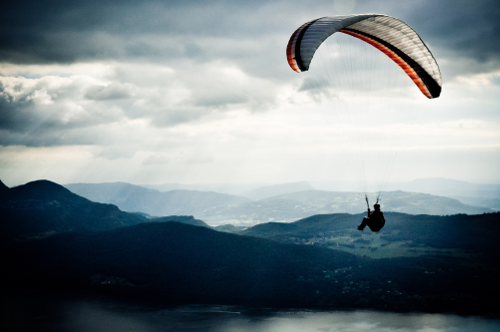

# PixelArtMaker

Generate palettes and dither any image with personal patterns.


## Index
- [What is it ?](#what-is-it-)
- [Usage](#usage)
  * [Example](#example)
  * [Palette generation](#palette-generation)
  * [Dithering](#dithering)
- [Build](#build)


## What is it ?

PixelArtMaker is a two-features graphics tool designed around the
style of [Pixel Art](http://en.wikipedia.org/wiki/Pixel_art). These
two functionalities are :

* Generating an optimized limited color palette for an image.
* [Dithering](http://en.wikipedia.org/wiki/Dither) an image with an
  arbitrary color palette, using a user-defined pattern.

The palette generation is made using a
[K-means clustering](http://en.wikipedia.org/wiki/K-means_clustering)
algorithm that tries to find the set of K colors that average best the
colors of the input image.

The dithering is a positional ordered dithering algorithm, similar to
the
[Bayer ordered dithering algorithm](http://en.wikipedia.org/wiki/Ordered_dithering).
However, instead of using the optimised Bayer matrix as a pattern, any
grayscale image can be used as pattern source. This is destined to
artists wanting to try out some artistic patterns in their
creation. Draw a pattern image, define your palette and launch the
dithering. If you like the result, use it (possibly tweaking it) or
try out something else !

## How does it actually work ?

The algorithm that generate the palette is pretty straightforward as
it is a strict use of the
[K-means clustering](http://en.wikipedia.org/wiki/K-means_clustering),
plus using it doesn't require to understand it. Just note that the
generated palette is *likely to have a shorter dynamic range* than the
original picture, so you may want to correct this afterward with any
image manipulation program.

While the palette generation does not require a precise understanding
of its mechanics in order to be used, it is advised to grasp some of
the underlying process when it comes to dithering.


## Usage

The `bin/` folder contains the two already compiled executables `palette` and `dither`.

### Example

Original picture:



Assuming you are located at the root of the repo, you can generate a
16 colors palette for the example picture `paraglider.png` and dither
it with an 8x8 Bayer pattern like this:

	$ ./palette picture.png 16 palette.png

Now you have an optimized 16 colors palette:


You can now dither this same picture, using for example the `bayer8.png` pattern:

	$ ./dither picture.png palette.png examples/bayer8.png dithered-picture.png

The 8x8 Bayer threshold matrix looks like this (zoom 8:1) :


Result:


Although the output from the `palette` command can be used as the
palette argument for the `dither` command, this is not mandatory.

### Palette generation

Syntax: `./palette imageFile colorsCount [outputFile]`

Parameters:

* `imageFile`: path to the image file that needs an optimized palette
* `colorsCount`: desired number of colors in the palette
* (optional) `outputFile`: name of the output palette image file
  (default to `palette-<colorsCount>-<imageFile>.png`)

### Dithering

Syntax: `./dither  imageFile paletteFile patternFile [outputFile]`

Parameters:

* `imageFile`: path to the image file to dither
* `paletteFile`: path to the palette to use
* `patternFile`: path to the image used as a dithering pattern
* (optional) `outputFile`: result image will be saved under this name
  (default to `<imageFile>-dithered-by-<patternFile>-with-<paletteFile>.png`)


## Build

In order to build the project, you will need the following
dependencies, listed here as Debian packages:

* `cimg-dev`: This is CImg library, the C++ image processing library used by the project.
* `libboost-filesystem-dev`: The Boost Filesystem Library. Used to
  manipulate paths and files.

```
$ sudo apt-get install libboost-filesystem-dev cimg-dev
```

Then you can compile the project using the provided `Makefile`:

```
$ make dither
$ make palette
```


