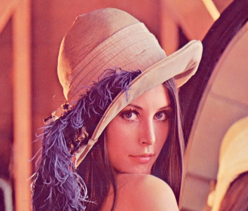
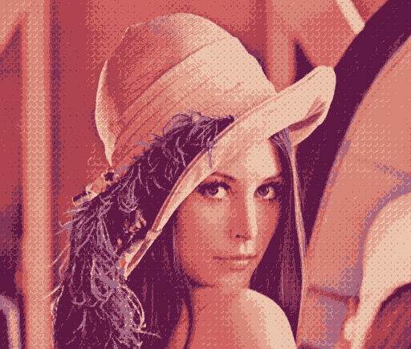

# Pixel Art Maker

## Standard Sample

Original picture:

Assuming you are located at the root of the repo, you can generate a 8 colors palette for the example picture `lena.jpg`:

	$ ./pixam palette doc/examples/lena.jpg 8 doc/examples/palette-8-lena.png

You can now dither this same picture, using for example the `pattern-bubble8.png` pattern:

	$ ./pixam dither doc/examples/lena.jpg doc/examples/palette-8-lena.png patterns/pattern-bubble8.png doc/examples/lena-bubble.png

You can now dither this same picture, using for example the `pattern-knut-odith.png` pattern:

	$ ./pixam dither doc/examples/lena.jpg doc/examples/palette-8-lena.png patterns/pattern-knut-odith.png doc/examples/lena-knut-odith.png

You can now undither dithered picture, using for example the `pattern-bubble8.png` pattern:

	$ ./pixam undither lena-bubble.png pattern-bubble8.png lena-undither.jpg

----  
https://github.com/Soreine/pixel-art-maker
